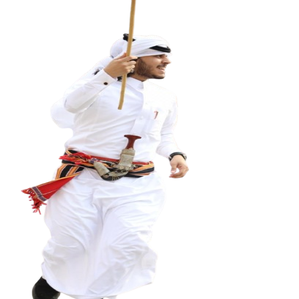
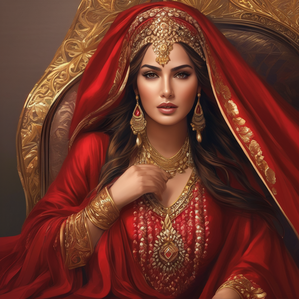
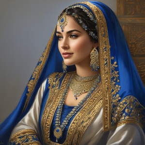
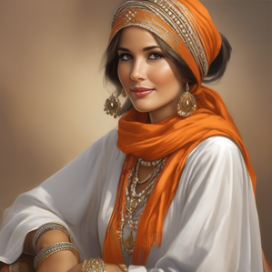
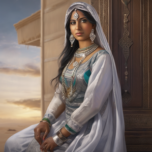
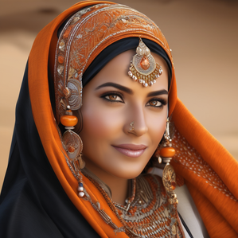
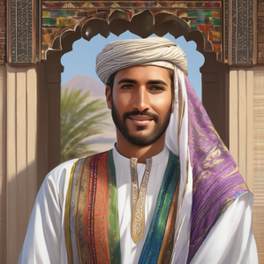
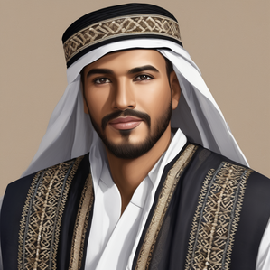
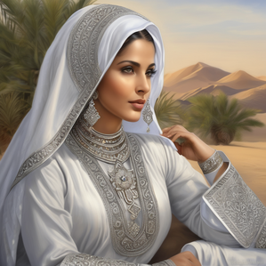
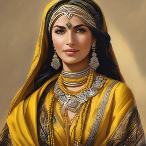

# Saudi Heritage Fashion AI Generator with SDXL LoRA

## Overview

**Saudi Heritage Fashion AI Generator** (**SHF**) is a generative AI project that fine-tunes **Stable Diffusion XL (SDXL)** using **LoRA (Low-Rank Adaptation)** to produce **digital art and cultural visualizations** of traditional Saudi fashion.

Inspired by **Saudi Founding Day** celebrations, the project seeks to digitally **celebrate, preserve, and honor** Saudi Arabia’s heritage fashion by reflecting authentic regional clothing styles for both men and women. The focus is not on strict photorealism but on creating **painting-like, artistic representations** that capture the elegance, symbolism, and cultural depth of Saudi heritage attire.

The project highlights three major Saudi heritage regions, each represented through its unique cultural identity and traditional fashion styles:

* **Asiri:** Southern regional clothing
* **Hijazi:** Western regional clothing
* **Najdi:** Central regional clothing

---

## Dataset Origin & Licenses

The dataset used to train the **Saudi Heritage Fashion (SHF)** model was **collected manually** from publicly available sources. At the time of collection, all images were openly accessible, which made them eligible for use in this project.

**Image Sources:**

* Saudi heritage websites and cultural archives
* Publicly published Saudi magazines and articles
* Social media platforms such as Instagram (public influencer accounts only)
* Other open online sources showcasing traditional Saudi attire

---

## Cultural Research & Annotation Process

Because many of the images were sourced from social media, they were not explicitly labeled or categorized by regional heritage style. Most were shared to celebrate **Saudi Founding Day** rather than for educational or documentation purposes.

To address this, I conducted cultural research through Saudi heritage-focused websites and articles to better understand:

* The nuanced differences between **Asiri, Hijazi, and Najdi** fashion styles
* The distinct elements of **men’s** and **women’s** attire within each region

Each collected image was then carefully **reviewed, categorized, and paired with a handcrafted text prompt** designed to reflect its cultural and stylistic attributes. This process not only ensured accurate dataset preparation but also helped me develop the ability to distinguish between regional styles for precise prompt creation.

---

## Dataset Details

* **Total training images:** `384`

* **Category breakdown by regional fashion style and gender:**

  * **Asiri style** (`132` images)

    * **Men:** `48` images
    * **Women:** `84` images

  * **Hijazi style** (`127` images)

    * **Men:** `40` images
    * **Women:** `87` images

  * **Najdi style** (`125` images)

    * **Men:** `36` images
    * **Women:** `89` images

* **Gender summary across all styles:**

  * **Total men images:** `124`
  * **Total women images:** `260`

* **Data format:**

  * `.png` image files
  * Paired `.txt` caption files describing gender, region, and detailed attire features

* **Preprocessing:**

  * All backgrounds removed
  * Replaced with a consistent **white background** to ensure clean training inputs

* **Captions:**
  * Manually crafted for each image to include **gender**, **region**, and detailed descriptions.

---

Below are **real samples** from the SHF dataset. They showcase traditional Saudi garments, headwear, embroidery, and patterns that are unique to each region and gender.

### Real Examples of Saudi Heritage Fashion for Women:

| Asiri  | Hijazi  | Najdi  |
|------------------|------------------|------------------|
|  |  |  |
|  |  |  |
|  |  |  |
|  |  |  |
|  |  |  |
|  |  |  |
|  |  |  |
|  |  |  |

---

### Real Examples of Saudi Heritage Fashion for Men:

| Asiri  | Hijazi  | Najdi  |
|------------------|------------------|------------------|
|  |  |  |
|  |  |  |
|  |  |  |
|  |  |  |
|  |  |  |
|  |  |  |

---

## Model Training: Fine-Tuning SDXL + LoRA on Saudi Heritage Fashion Dataset

### Training Configuration

| Setting                     | Value                                                          |
| --------------------------- | -------------------------------------------------------------- |
| **Base Model**              | `stabilityai/stable-diffusion-xl-base-1.0`                     |
| **VAE**                     | `madebyollin/sdxl-vae-fp16-fix`                                |
| **Image Resolution**        | 768×768 bucketed (min 256, max 1024, step 64)                  |
| **Training Data Dir**       | `saudi-heritage-dataset`                                       |
| **LoRA Type**               | `LoRA_LierLa (LoRA with additional linear layers)`             |
| **LoRA Rank / Alpha**       | **32 / 16**                                                    |
| **Modules Trained**         | **UNet + Text Encoders (TE1 & TE2)** (LoRA on both)            |
| **Training Epochs**         | **10**                                                         |
| **Approx. Optimizer Steps** | **\~1,920** (384 images × 10 epochs ÷ grad-accum 2)            |
| **Batch Size**              | 1                                                              |
| **Gradient Accumulation**   | 2                                                              |
| **Optimizer**               | **Prodigy**                                                    |
| **Learning Rate**           | `1e-4` (applied to UNet **and** text encoders)                 |
| **Scheduler**               | `constant_with_warmup`                                         |
| **Warmup Steps**            | 0                                                              |
| **Mixed Precision**         | `fp16`                                                         |
| **Seed**                    | `-1` (random)                                                  |
| **Logging**                 | Weights & Biases (`wandb`) enabled                             |
| **Sample Prompts**          | Taken from paired **`.txt`** captions                          |
| **Preview Sampler / Steps** | `euler_a`, **28** steps                                        |
| **Save Frequency**          | Every 10 epochs                                                |
| **Aspect-Ratio Bucketing**  | Enabled (min 256, max 1024, step 64)                           |
| **Flip Augmentation**       | Enabled                                                        |
| **Latent Caching**          | Enabled                                                        |
| **LoRA File**               | `Saudi-Heritage-Lora.safetensors`                              |
| **Hardware**                | Google Colab Free — NVIDIA **T4 (16 GB VRAM)**, \~12–15 GB RAM |
| **Trainer Framework**       | **Kohya LoRA Trainer**                                         |

> **Full Training Notebook:** [`Saudi_Heritage_Fashion_SDXL_LoRA_Kohya_Training.ipynb`](https://github.com/kalthommusa/Saudi-Heritage-Fashion-SDXL-LoRA/blob/master/Saudi_Heritage_Fashion_SDXL_LoRA_Kohya_Training.ipynb)     

---

### Training Analysis

#### Loss Monitoring

The training process was tracked via **Weights & Biases (wandb)** across 10 epochs, logging both current and average loss at every step:

* **`loss/current`**

 

  This chart shows the current loss value at each individual training step. The values stayed within a reasonable range under **0.3**, indicating that the model was learning stably without diverging or collapsing during training.

* **`loss/average`**

 

  This smoothed curve shows the moving average of the training loss across all steps. The average loss remained nearly flat, hovering around **0.08** from start to finish. This suggests early convergence and consistent learning, which means the model adapted quickly to the dataset and maintained stable learning behavior.

---

#### Learning Rate Monitoring

All learning rates remained steady across components throughout training, confirming the use of the `constant_with_warmup` scheduler. This stability contributed to smooth convergence:

* **`lr/unet`**

 

  The UNet component (image generation backbone) was trained with a constant LR of `1e-4`, as indicated by the flat curve.

* **`lr/text_encoder`**

 

  Similarly, the text encoder (which processes text prompts) used a fixed LR of `1e-4`, ensuring synchronized optimization between text and image branches.

* **`lr/D*lr`**

 

  This metric stayed near `1e-10`, indicating no dynamic adjustment or secondary learning rate strategy was applied, likely a placeholder with no impact on learning.

---

### Model Inference: Generating Images with SDXL + LoRA on Saudi Heritage Fashion Dataset

> **Full Inference Notebook:** [`Saudi_Heritage_Fashion_SDXL_LoRA_Inference.ipynb`](https://github.com/kalthommusa/Saudi-Heritage-Fashion-SDXL-LoRA/blob/master/Saudi_Heritage_Fashion_SDXL_LoRA_Inference.ipynb)  

The model generates digital art and cultural visualizations that highlight the diversity of Saudi heritage fashion across women’s and men’s styles. Outputs are presented with an artistic, illustrative quality rather than strict photorealism, reflecting the project’s goal of cultural storytelling through visual art.

---

## SHF Model Outputs – Women (3 Saudi Regional Styles)

| Asiri Style                                                 | Hijazi Style                                                  | Najdi Style                                                 |
| ----------------------------------------------------------- | ------------------------------------------------------------- | ----------------------------------------------------------- |
|   |  |  |
|   |  |  |
|   |   |  |
|  |  |  |
|  |   |  |
|  |   |  |
|   |   |  |
|  |  |   |
|  |   |  |
|  |  |  |
|   |  |  |
|  |  |  |
|  |  |  |
|  |   |  |
|  |  |  |
|  |  |  |
|   |  |   |
|  |  |  |
|  |  |  |
|  |  |  |
|   |  |  |
|  |  |  |
|   |  |   |
|   |  |   |
|   |  |   |
|   |  |   |

---

## SHF Model Outputs – Men (3 Saudi Regional Styles)

| Asiri Style                                             | Hijazi Style                                              | Najdi Style                                             |
| ------------------------------------------------------- | --------------------------------------------------------- | ------------------------------------------------------- |
|   |  |  |
|   |  |  |
|   |  |   |
|  |  |  |
|  |  |  |
|   |   |  |
|  |   |   |
|  |  |  |
|   |  |  |
|  |  |  |
|   |   |  |
|   |  |  |
|  |  |  |
|  |   |   |
|  |   |  |
|  |  |   |
|  |  |   |
|  |   |   |
|  |  |   |
|  |  |   |
|  |   |  |
|  |   |  |
|  |  |  |
|  |  |  |
|  |   |  |
|  |  |  |
|  |  |  |
|  |  |  |
|  |  |  |

---

## Example Prompts

* `"Saudi Asiri woman, traditional Asiri dress, silver embroidery, heritage clothing, artistic illustration"`
* `"woman in white Hijazi dress, golden embellishment, traditional Saudi headwear, Hijazi culture, artistic visualization"`
* `"traditional Najdi woman, golden headpiece, embroidered dress, cultural clothing, artistic illustration"`
* `"Asiri man, traditional outfit, desert background, digital art"`
* `"Hijazi man, traditional outfit, Hijazi cultural embroidery, painting visualization"`
* `"Najdi man, traditional embroidered thobe, Saudi central region, heritage outfit, cultural visualization"`

---

## Quantitative Evaluation

To assess the realism, cultural authenticity, and prompt alignment of the SHF model’s outputs, I computed two key metrics across three Saudi heritage fashion styles, evaluated separately for men and women:

1. **Fréchet Inception Distance (FID)** 
2. **CLIP Score** 

### 1. Fréchet Inception Distance (FID):

FID evaluates similarity between generated images and real-image distributions by comparing their high-level features.

Lower scores → outputs closer to real photographs.

Higher scores → outputs diverge more, often reflecting stylistic abstraction or artistic re-interpretation rather than realism.

Since this project’s goal is not strict photorealism but cultural visualization, FID values are interpreted here as an indicator of how far the generated outputs stylistically depart from photographic realism.

### FID Evaluation Dataset

For FID evaluation, I prepared a **separate, standardized dataset** distinct from the training set.
Unlike the training dataset (which contained images of varying resolutions), FID requires all images to share the same size. To achieve this, I removed low-resolution or small-dimension samples and resized all remaining images to **299×299**.

The FID dataset was structured by **gender** and **regional heritage style**, each style-gender group contained equal numbers of **real** and **generated** images:

| Style     | Women (real/generated) | Men (real/generated) |
| --------- | ---------------------- | -------------------- |
| Asiri     | 84 / 84                | 41 / 41              |
| Hijazi    | 87 / 87                | 29 / 29              |
| Najdi     | 88 / 88                | 36 / 36              |

**FID Results:**

| Style  | Women  | Men    |
| ------ | ------ | ------ |
| Asiri  | 159.34 | 224.61 |
| Hijazi | 125.91 | 228.40 |
| Najdi  | 141.12 | 188.48 |

> **Full FID Evaluation Notebook:** [`Saudi_Heritage_Fashion_SDXL_LoRA_FID_Evaluation.ipynb`](https://github.com/kalthommusa/Saudi-Heritage-Fashion-SDXL-LoRA/blob/master/Saudi_Heritage_Fashion_SDXL_LoRA_FID_Evaluation.ipynb)

**Observation:**
FID scores are noticeably lower for **women’s styles**, particularly **Hijazi**, suggesting that the model captured these visual distributions more effectively. In contrast, **men’s styles**, especially **Hijazi**, exhibited higher FID scores, reflecting greater artistic abstraction. This suggests that women’s outputs leaned somewhat closer to realism, whereas men’s outputs captured more interpretive, painting-like qualities.

---

### 2. CLIP Score:

CLIP measures how well each generated image aligns with its corresponding text prompt.

Higher scores → stronger semantic consistency between the image and the described prompt.

### CLIP Evaluation Dataset

For CLIP score evaluation, I prepared a **separate dataset** of generated images paired with their corresponding text prompts, which are the exact same prompts used during image generation, ensuring semantic alignment between the images and text.

The CLIP dataset was structured by **gender** and **regional heritage style** (following the same structure and evaluation logic as the FID dataset), with **6 prompt files** (one for each gender × region combination).

**Image counts per category:** 

| Style      | Women | Men |
| ---------- | ----- | --- |
| **Asiri**  | 80    | 33  |
| **Hijazi** | 83    | 28  |
| **Najdi**  | 80    | 33  |

**Prompt files per category:**

| Style      | Women Prompt File | Men Prompt File |
| ---------- | ----------------- | --------------- |
| **Asiri**  | `asiri.txt`       | `asiri.txt`     |
| **Hijazi** | `hijazi.txt`      | `hijazi.txt`    |
| **Najdi**  | `najdi.txt`       | `najdi.txt`     |

Each group of images was evaluated directly against its corresponding prompt file, ensuring that every generated sample was measured against text specifically designed to capture its cultural and stylistic attributes.

**CLIP Results:**

| Style  | Women  | Men    |
| ------ | ------ | ------ |
| Asiri  | 0.2799 | 0.2914 |
| Hijazi | 0.2811 | 0.3221 |
| Najdi  | 0.2877 | 0.2996 |

> **Full CLIP Evaluation Notebook:** [`Saudi_Heritage_Fashion_SDXL_LoRA_CLIP_Evaluation.ipynb`](https://github.com/kalthommusa/Saudi-Heritage-Fashion-SDXL-LoRA/blob/master/Saudi_Heritage_Fashion_SDXL_LoRA_CLIP_Evaluation.ipynb)

**Observation:**
CLIP scores are generally higher for **men’s styles**, with **Hijazi men** reaching the highest alignment (0.3221). Conversely, **women’s Asiri** scored the lowest (0.2799), reflecting more difficulty in aligning the text prompts with complex embroidery and visual details for that category.

---

## Qualitative Evaluation

Even with relatively high FID values and moderate CLIP scores, the generated outputs demonstrate strong artistic and cultural visualization qualities. Many results, particularly for women’s heritage clothing are **visually compelling, richly detailed, and culturally resonant**, aligning with the project’s digital art focus.

1. **FID**

The below are examples of generations closest to and farthest from real-image distributions:

### Closest to real-image distribution (Women — Hijazi Style):

| Real Hijazi Outfit                                       | SHF’s Generated Output                                             |
| -------------------------------------------------------- | ------------------------------------------------------------- |
|  |  |
|  |  |
|  |  |
|  |  |
|  |  |
|  |  |
|  |   |
|  |  |
|  |  |

### Most divergent from real-image distribution (Men — Hijazi Style):

| Real Hijazi Outfit                                   | SHF’s Generated Output                                          |
| ---------------------------------------------------- | --------------------------------------------------------- |
|   |   |
|  |  |
|   |   |
|  |  |
|  |   |
|   |  |
|  |  |
|  |  |
|   |  | 

---

2. **CLIP**

The examples below highlight samples with the higher and lower CLIP outcomes, showing where the model achieved the strongest prompt-image alignment and where it struggled.

### Strongest prompt-image alignment (Men — Hijazi Style):

| SHF’s Generated Output                                    | Prompt Used                                                                                                           |
| --------------------------------------------------------- | --------------------------------------------------------------------------------------------------------------------- |
|  | *"Hijazi man, traditional Hijazi clothing, orange turban, heritage fashion, western Saudi Arabia, digital art"* |
|   | *"Hijazi man, traditional outfit, desert background, artistic illustration"*                                 |
|  | *"A man wearing traditional Saudi Hijazi outfit, painting visualization"*                                                 |
|  | *"Hijazi man, traditional Hijazi clothing, orange turban, heritage fashion, western Saudi Arabia, digital art"*   |
|  | *"Hijazi man, traditional Hijazi clothing, orange turban, heritage fashion, western Saudi Arabia, digital art"* |
|   | *"Hijazi man, traditional Hijazi clothing, orange turban, heritage fashion, western Saudi Arabia heritage, cultural visualization"*                                 |
|  | *"Hijazi man, traditional Hijazi clothing, orange turban, heritage fashion, western Saudi Arabia, digital art"*   |
|  | *"Hijazi man, traditional outfit, desert background, artistic illustration"* |
|   | *"Hijazi man, traditional Hijazi clothing, orange turban, heritage fashion, western Saudi Arabia, digital art"*                                 |

---

### Weakest prompt-image alignment (Women — Asiri Style):

| SHF’s Generated Output                                      | Prompt Used                                                                                                                                    |
| ----------------------------------------------------------- | ---------------------------------------------------------------------------------------------------------------------------------------------- |
|   | *"Asiri woman, heritage straw hat with orange headscarf, traditional dress, embroidered sleeves, traditional jewelry, cultural visualization"* |
|  | *"Saudi Asiri woman, traditional Asiri dress, silver embroidery, heritage clothing, artistic illustration"*                                 |
|  | *"Saudi woman, traditional Asiri dress, orange headband, heritage outfit, cultural visualization"*                                                                              |
|  | *"A woman wearing a cultural Saudi Asiri heritage fashion, artistic illustration"*                                          |
|  | *"Saudi Asiri woman, traditional Asiri dress, silver embroidery, heritage clothing, artistic illustration"*                                                                              |
|  | *"Saudi woman dressed in Asiri heritage clothing, orange headband, artistic illustration"*                                          |
|  | *"Asiri woman, traditional dress, silver embroidery, mountain background, digital art"*                                                                              |
|  | *"Asiri woman, heritage straw hat, yellow scarf, traditional dress, embroidered sleeves, traditional jewelry, cultural visualization"*                                          |
|  | *"Saudi Asiri woman, traditional Asiri dress, silver embroidery, heritage clothing, artistic illustration"*                                          |

---

## Analysis of Evaluation Metrics

The evaluation provides complementary insights into the SHF model’s strengths and areas for refinement:

FID: High scores reflect artistic divergence from realism photographic distributions, which is expected for a cultural visualization model. These values should be interpreted as stylistic distance rather than failure.

CLIP: A more reliable measure of success in this domain, as it captures how well generated art aligns with cultural prompts. Strong results for men’s Hijazi attire show that the model effectively encodes semantic attributes of that style.

These results serve as **baseline benchmarks** for this niche, culturally specific domain. They help identify where the model performs well and where refinement is most needed.

### Key Factors Influencing Results

* **Dataset Imbalance**
  Women’s attire was better represented (260 images) than men’s (124). Male heritage fashion is less represented online, limiting the model’s exposure to diverse male clothing variations. This imbalance contributed to stronger outputs for women’s categories and higher FID values for men’s styles.

* **Prompt Complexity**
  Saudi heritage fashion, especially women’s attire involves highly intricate embroidery, patterns, jewelry, and accessories. Capturing these nuanced cultural details with short text prompts is challenging, impacting CLIP alignment for women’s categories

---

## Future Work

To further enhance both **FID** and **CLIP** scores, as well as overall **visual quality**, I plan to:

1. **Dataset Expansion & Balancing**

   * Increase the number of training samples, especially for men’s regional outfits.
   * Ensure balanced representation across genders and styles.
   * Prioritize **high-quality, high-resolution images**.

2. **Refined Prompt Engineering**

   * Craft more detailed prompts with region-specific cultural terminology to strengthen stylistic and semantic alignment.

3. **Optimized Fine-Tuning**

   * Experiment with LoRA hyperparameters (e.g., training epochs, learning rate) for richer artistic outcomes.
   * Explore advanced models such as `stable-diffusion-xl-refiner` or `SDXL Turbo` for higher detail and painterly precision.

4. **Collaboration with Cultural Experts**

   * Because the project involves cultural heritage visualization, a domain of high sensitivity, consulting **Saudi cultural heritage specialists** will be essential to ensure both authenticity and credibility of traditional attire.

   * Work with **Saudi heritage fashion designers, male and female models, and professional photographers** to create high-resolution images that expand the training dataset and accurately represent the diversity of Saudi heritage across all regions beyond just Asiri, Hijazi, and Najdi.

   * Leverage expert knowledge to **design nuanced prompts** that capture the authentic details of garments, fabrics, and embroidery.

   * Involve **cultural fashion specialists** in the human evaluation stage to validate and assess the authenticity of generated artistic outputs.

---

## Conclusion

The **Saudi Heritage Fashion (SHF)** project operates within a **culturally rich yet data-scarce domain**. 
Despite dataset imbalance and the limited availability of male fashion references, the model already demonstrates:

* Cultural authenticity in many **women’s heritage clothing styles**.
* Encouraging semantic alignment in categories like **Hijazi men’s fashion**.
* A **solid foundation** for AI-driven cultural preservation, painting-like digital art, and creative exploration.

With planned improvements, SHF is well-positioned to achieve **higher fidelity**, **deeper cultural alignment**, and **enhanced visual realism** across all Saudi heritage fashion styles, making it a valuable step toward preserving and celebrating Saudi Arabia’s fashion heritage through cutting-edge generative AI.

---